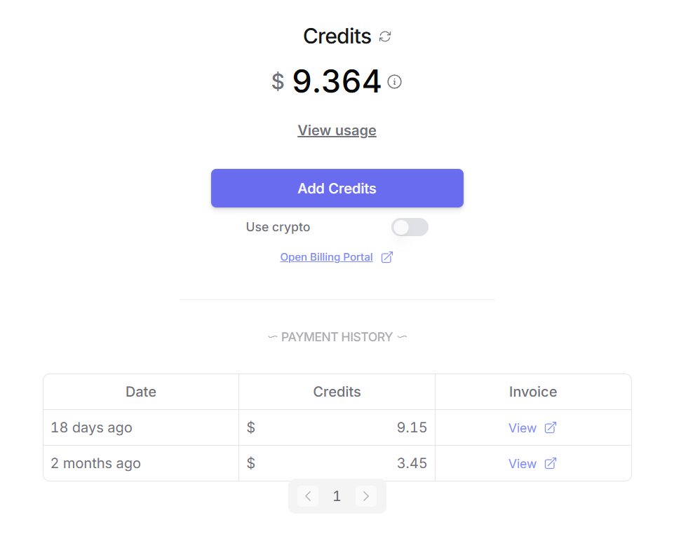

[TOC]


# cline 调用api

### deepseek官网api调用


api购买网址：[DeepSeek 开放平台](https://platform.deepseek.com/usage)


① 创建api key


② 在cline的setting部分如下设置： 其中deepseek chat 是v3   reasoner是r1


然后对话即可，这里是让deepseek 生成readme 也可以用于代码的修改，

**特别注意！ AI 代码可能会有问题 还有修改是自动化完成的 所以修改前 做好备份！！！！！**

****


结果：


### 阿里云调用api

如果在白天 deepseek官网反应过慢，可以使用第三方的部署平台

官网：[大模型服务平台百炼_企业级大模型开发平台_百炼AI应用构建-阿里云](https://www.aliyun.com/product/bailian)  支付宝扫码登录即可

在这里我推荐一个 阿里的Moe大模型 qwen - 2.5-MAX 打榜效果是比 deepseek v3 要好一些的；

配置如下： 

注意选择 OpenAI Compatible

url：

```
https://dashscope.aliyuncs.com/compatible-mode/v1

```

名称使用： qwen-max-latest （这个就是用的阿里的最新大模型（非推理模型） 个人感觉cline用非推理就好了）

如果想使用 deepseek 可以改为 “deepseek-r1” 或者 “deepseek-v3”

其中的 API key在阿里百炼哪个官网即可设置  余额好像需要买一些。


### openrouter 调用api

官网：[OpenRouter](https://openrouter.ai/)

用QQ邮箱即可注册，


设置api key然后复制即可。

相同设置即可，注意这里模型选择是有一些可以免费使用的 （以free作为后标） 


充值的话 点击Credits 即可，只不过是实打实 RMB 兑换USD 很肉疼。




# 网页端如何用上好用的deepseek？

### 首选字节跳动的-火山引擎


麻烦大家先用这个邀请码 来搞 可以给互相一些代金券，注意我得邀请码哦！！

DeepSeek满血版免费领啦！邀请好友注册和使用，最高双方可获得145元代金券，免费抵扣3625万tokens，畅享R1与V3模型！参与入口：https://www.volcengine.com/experience/ark?utm_term=202502dsinvite&ac=DSASUQY5&rc=9XTC1PWL  邀请码：9XTC1PWL


官网：https://www.volcengine.com/


点击模型选择即可

下面就是一个网页端的deepseek-r1 ，注意 火山每个模型只给了50w tokens 所以如果用完了就需要花钱或者代金券。（也可以嫖一下父母的手机号来搞哈哈哈）


这个平台有个好处可以 一个指令调用两个模型 进行对比 不过太费token了 我一般只用r1 ，个人认为是吐token和思考推理最快的平台之一了。


### 最好的deepseek当然是超过deepseek的qwen!!

官网：[Qwen](https://chat.qwenlm.ai/)

qwen2.5-Max 目前知道的人还不多所以官网就特别快 可以理解为 qwen2.5max 就是用deepseekv3 方法做的Moe大模型，但是打榜比v3要厉害一些。

点击下面的 QwQ 就是推理模型  也比较好用一些。


